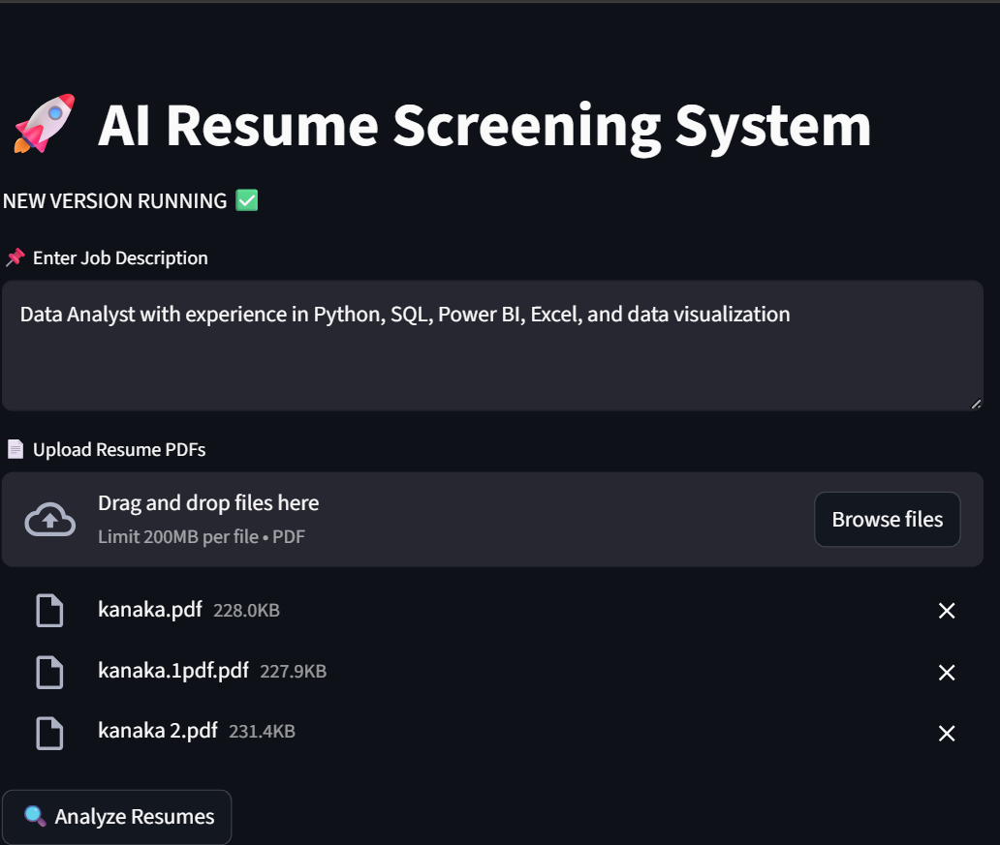
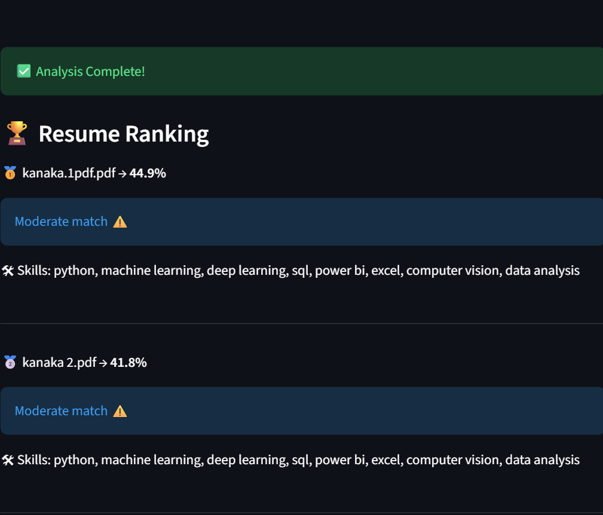
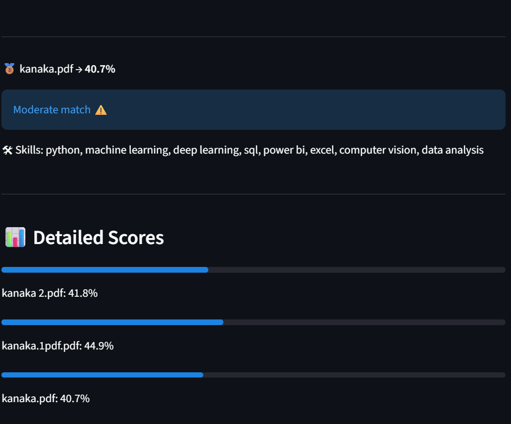

# 🚀 AI Resume Screening System

✨ Built using BERT-based NLP to improve resume screening beyond keyword matching.

---

## 📌 Problem

Manual resume screening is time-consuming and often limited to keyword matching, which can overlook strong candidates who use different wording or phrasing.

---

## 💡 Solution

This system uses **BERT-based semantic similarity** to understand the meaning behind resumes and job descriptions, enabling more accurate candidate ranking and better hiring decisions.

---

## 🔍 Features

- 📄 Upload and analyze multiple PDF resumes  
- 🧠 Semantic matching using BERT (not just keywords)  
- 🏆 Rank candidates based on job relevance  
- 🛠 Automatic skill extraction  
- 📊 Match score visualization  
- ⚡ Real-time resume analysis  

---

## ⚙️ Tech Stack

- Python  
- Streamlit  
- Sentence Transformers (BERT)  
- Scikit-learn  
- PDFPlumber  

---

## 📸 Screenshots

### 🖥️ Application Interface


### 🏆 Resume Ranking


### 📊 Detailed Score Visualization


---

## 🔗 Project Link
👉 https://github.com/Kanaka-VY/ai-resume-screening-system

## 🚀 How to Run Locally

```bash
# Clone the repository
git clone https://github.com/Kanaka-VY/ai-resume-screening-system.git

# Navigate to project folder
cd ai-resume-screening-system

# Install dependencies
pip install -r requirements.txt

# Run the application
streamlit run app.py
